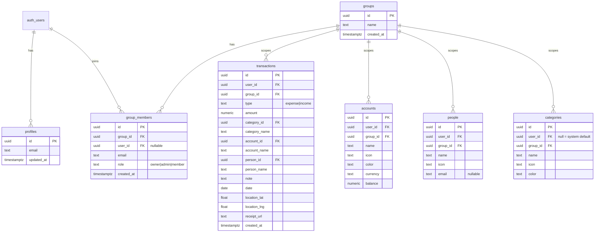
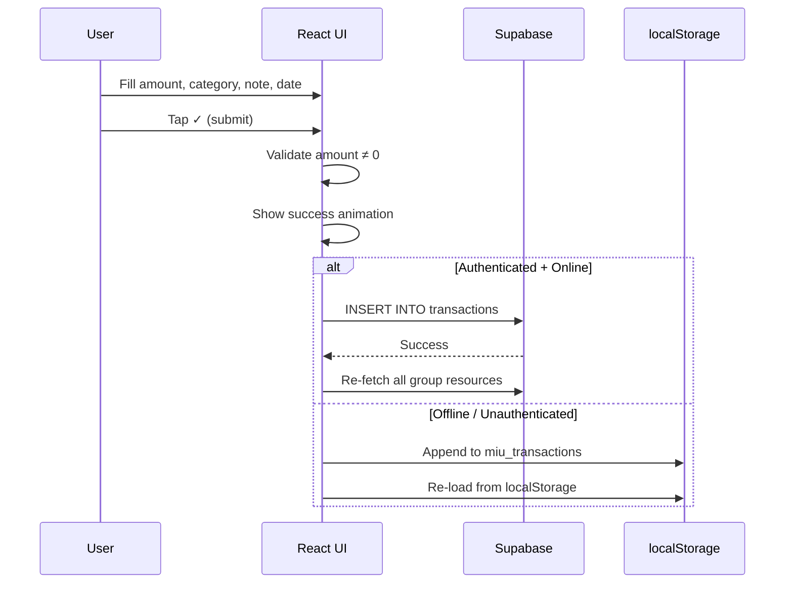
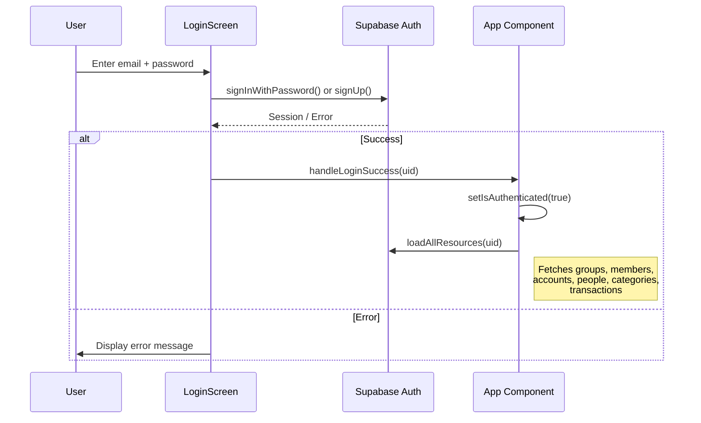
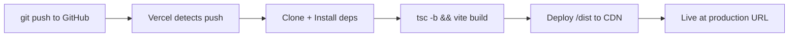

# Miu Expense Tracker — Architecture & Tech Stack

> **Version**: 1.0  
> **Last updated**: 2026-06-24

---

## 1. Project Overview

**Miu Expense** is a multi-tenant family/personal expense ledger designed as a mobile-first Progressive Web App (PWA). Users can track income & expenses, attach receipt photos, tag transactions with categories/accounts/people, and share a family ledger with role-based access control.

---

## 2. Tech Stack Summary

| Layer | Technology | Version | Purpose |
|-------|-----------|---------|---------|
| **Language** | TypeScript | ~6.0 | Static typing across the entire codebase |
| **UI Framework** | React | 19.2 | Component-based UI rendering |
| **Build Tool** | Vite | 8.x | Dev server, HMR, and production bundling (Rollup) |
| **Styling** | Tailwind CSS | 4.x (Vite plugin) | Utility-first CSS with custom `@utility` directives |
| **Icons** | Lucide React | 1.21 | Tree-shakable SVG icon library |
| **Backend (BaaS)** | Supabase | 2.108 | Auth, Postgres DB, Storage, Row-Level Security |
| **Hosting** | Vercel | — | Static hosting with CI/CD from GitHub |
| **PWA Runtime** | Custom Service Worker | — | Offline caching (stale-while-revalidate) |

---

## 3. High-Level Architecture

```
┌────────────────────────────────────────────────────────────────┐
│                        Client (Browser)                        │
│                                                                │
│   ┌──────────────┐   ┌──────────────┐   ┌──────────────────┐  │
│   │  React SPA   │   │  Service     │   │  localStorage    │  │
│   │  (Vite +     │   │  Worker      │   │  (Offline        │  │
│   │  Tailwind)   │   │  (Cache)     │   │   Fallback)      │  │
│   └──────┬───────┘   └──────┬───────┘   └────────┬─────────┘  │
│          │                  │                     │            │
└──────────┼──────────────────┼─────────────────────┼────────────┘
           │                  │                     │
           ▼                  ▼                     │
┌──────────────────────────────────┐                │
│         Supabase (BaaS)          │                │
│                                  │                │
│  ┌──────────┐  ┌─────────────┐   │                │
│  │  Auth     │  │  Storage    │   │  (offline mode │
│  │  (Email   │  │  (Receipts  │   │   writes here) │
│  │  + Pass)  │  │   Bucket)   │   │                │
│  └──────────┘  └─────────────┘   │                │
│                                  │                │
│  ┌───────────────────────────┐   │                │
│  │  PostgreSQL               │   │                │
│  │  + Row Level Security     │   │                │
│  │  + Security Definer Fns   │   │                │
│  │  + Triggers               │   │                │
│  └───────────────────────────┘   │                │
└──────────────────────────────────┘                │
                                                    │
┌──────────────────────────────────┐                │
│  Vercel (Hosting & CI/CD)        │◄───────────────┘
│  - Auto-deploy from GitHub       │  (serves the SPA)
│  - Build: tsc -b && vite build   │
│  - Output: /dist                 │
└──────────────────────────────────┘
```

---

## 4. Frontend Architecture

### 4.1 Entry Point & Bootstrapping

```
index.html                      ← HTML shell with PWA meta tags
  └─ src/main.tsx                ← React 19 createRoot, StrictMode, SW registration
       └─ src/App.tsx            ← Root component: auth gate, state, all views
            └─ src/index.css     ← Tailwind v4 import + custom @utility & @keyframes
```

- **Single Page Application (SPA)** — no client-side router; navigation is handled via an `activeTab` state (`'input' | 'home' | 'analytics' | 'others'`).
- **No external state manager** — all global state lives in the `App` component using React `useState` / `useEffect` / `useMemo` hooks.

### 4.2 Component Map

```
src/
├── App.tsx                        # Root component (~1,770 lines)
├── main.tsx                       # Bootstrap + Service Worker registration
├── index.css                      # Tailwind v4 + custom utilities & animations
├── App.css                        # Minimal additional styles
│
├── components/
│   ├── LoginScreen.tsx            # Email/password auth (sign-in / sign-up)
│   ├── GroupManagementModal.tsx    # Create/switch groups, invite members, RBAC
│   ├── CategoryGrid.tsx           # Scrollable category chip selector
│   ├── Keypad.tsx                 # Numeric keypad with calculator ops (+−×÷)
│   ├── DatePickerModal.tsx        # Custom calendar date picker modal
│   ├── ReceiptScanner.tsx         # Camera capture + Supabase Storage upload
│   ├── Modals.tsx                 # Account & Person picker sheet modals
│   ├── ManageResources.tsx        # CRUD manager for Accounts, Categories, People
│   ├── TransactionFilters.tsx     # Search bar + advanced filter panel
│   ├── SwipeableTransaction.tsx   # Swipe-to-delete transaction row
│   ├── TransactionDetailModal.tsx # Full transaction detail view with receipt
│   └── AnalyticsDashboard.tsx     # Charts: bar, donut, spending summaries
│
├── lib/
│   └── supabase.ts                # Supabase client init + mock fallback
│
└── types/
    └── index.ts                   # Shared TypeScript interfaces
```

### 4.3 Theming System

The app supports **4 built-in color themes** defined as `ThemeConfig` objects:

| Theme Key | Name |
|-----------|------|
| `white-blue` | White & Blue (default) |
| `white-green` | White & Green |
| `white-pink` | White & Pink |
| `black-pink` | Black & Pink (dark mode) |

Each theme provides ~30 semantic token keys (e.g. `bg`, `textMain`, `primary`, `surface`, `modalBg`, `keypadContainer`, etc.) mapped to Tailwind utility classes. The active theme is applied by passing the theme object `t` as a prop/context throughout the component tree.

### 4.4 Custom CSS Animations

Defined in `src/index.css` as Tailwind v4 `@utility` directives:

| Utility Class | Animation | Use Case |
|--------------|-----------|----------|
| `animate-scan` | Vertical scan line | Receipt scanner overlay |
| `animate-swipe-reveal` | Slide left 80px | Swipe-to-delete gesture |
| `animate-chart-grow` | Scale Y with bounce | Bar chart entrance |
| `animate-donut` | Stroke-dasharray fill | Donut chart ring draw |
| `animate-filter-down` | Max-height expand | Filter panel slide |
| `animate-fade-scale-in` | Opacity + scale | Delete confirmation dialog |

---

## 5. Backend Architecture (Supabase)

### 5.1 Authentication

- **Method**: Email + Password (Supabase Auth).
- **Session persistence**: Controlled by a `miu_keep_logged_in` flag in `localStorage`. If the flag is absent on app load, the session is explicitly signed out.
- **Auth listener**: `supabase.auth.onAuthStateChange()` syncs React state on login/logout events.

### 5.2 Database Schema (PostgreSQL)



### 5.3 Row Level Security (RLS)

All tables have RLS enabled. Three **Security Definer** helper functions prevent infinite recursion when RLS policies reference `group_members`:

| Function | Returns `true` when... |
|----------|----------------------|
| `is_group_member(group_id)` | Current user is a member of the group |
| `is_group_admin_or_owner(group_id)` | Current user has `admin` or `owner` role |
| `is_group_owner(group_id)` | Current user has `owner` role |

**Policy Summary:**

| Table | SELECT | INSERT | UPDATE | DELETE |
|-------|--------|--------|--------|--------|
| `groups` | Member | — | Owner | — |
| `group_members` | Member | Admin/Owner | Admin/Owner | Admin/Owner |
| `transactions` | Member | Member | Admin/Owner | Admin/Owner |
| `accounts` | Member | Member | Admin/Owner | Admin/Owner |
| `categories` | System defaults + Member | Member | Admin/Owner | Admin/Owner |
| `people` | Member | Member | Admin/Owner | Admin/Owner |

### 5.4 Database Triggers

| Trigger | Function | Fires On | Purpose |
|---------|----------|----------|---------|
| `on_auth_user_created` | `handle_new_user()` | `AFTER INSERT` on `auth.users` | Seeds profile + default accounts & people |
| `on_auth_user_created` | `link_new_user_to_groups()` | `AFTER INSERT` on `auth.users` | Auto-links pre-invited members by email |

### 5.5 File Storage

- **Bucket**: `receipts` (public read access).
- **Upload**: Authenticated users only.
- **Delete**: Users can delete files in their own folder (`auth.uid()` as folder name).
- **Usage**: Receipt photos are uploaded via the `ReceiptScanner` component, and the public URL is stored in `transactions.receipt_url`.

---

## 6. Multi-Tenancy Model

The app implements a **group-based multi-tenant** architecture. See [multitenant_architecture.md](file:///Users/arifindobson/Documents/arifinProject/miu-expense/requirements/multitenant_architecture.md) for full details.

### Key Points

1. **Tenant = Group** — each group represents a shared family ledger.
2. **Users belong to multiple groups** — the `group_members` junction table establishes the many-to-many relationship.
3. **All resources are group-scoped** — transactions, accounts, people, and categories reference a `group_id`.
4. **Client-side group switching** — the active group is stored in React state and persisted in `localStorage` as `miu_active_group`.
5. **Pre-onboarding** — users can be invited by email before they register. A database trigger auto-links their account upon signup.

### Role-Based Access Control (RBAC)

| Role | View data | Create transactions | Edit/Delete transactions | Manage members |
|------|-----------|--------------------|-----------------------|----------------|
| **Owner** | ✅ | ✅ | ✅ | ✅ |
| **Admin** | ✅ | ✅ | ✅ | ✅ |
| **Member** | ✅ | ✅ | ❌ | ❌ |

### View Modes

- **Group view** (`ledgerViewMode: 'group'`): Shows all transactions in the active group.
- **Individual view** (`ledgerViewMode: 'individual'`): Filters to only the current user's transactions.

---

## 7. Progressive Web App (PWA)

### 7.1 Manifest

Configured in `public/manifest.json`:
- **Display**: `standalone` (full-screen, no browser chrome).
- **Orientation**: `portrait`.
- **Theme color**: `#6366f1` (Indigo).

### 7.2 Service Worker

Located at `public/sw.js`, using a **stale-while-revalidate** caching strategy:

1. **Install**: Pre-caches core shell assets (`/`, `/index.html`, `/favicon.svg`, `/manifest.json`).
2. **Fetch**: Serves cached responses first, then fetches updates in the background. Supabase API calls (`supabase.co`) are excluded from caching.
3. **Activate**: Cleans up old cache versions.

### 7.3 Offline Fallback

When Supabase is unreachable, the app falls back to `localStorage` for CRUD operations:

| Resource | localStorage Key |
|----------|-----------------|
| Transactions | `miu_transactions` |
| Custom accounts | `miu_custom_accounts` |
| Custom people | `miu_custom_people` |
| Custom categories | `miu_custom_categories` |
| Active group | `miu_active_group` |
| Group members | `miu_group_members` |
| User role | `miu_user_role` |
| Keep logged in | `miu_keep_logged_in` |

---

## 8. Data Flow

### 8.1 Transaction Creation Flow



### 8.2 Authentication Flow



---

## 9. Build & Deployment Pipeline

### 9.1 Development

```bash
npm run dev          # Vite dev server with HMR (http://localhost:5173)
```

### 9.2 Production Build

```bash
npm run build        # tsc -b && vite build → outputs to /dist
```

### 9.3 Deployment (Vercel)



**Environment Variables** (set in Vercel dashboard):
- `VITE_SUPABASE_URL` — Supabase project URL
- `VITE_SUPABASE_ANON_KEY` — Supabase anonymous public API key

### 9.4 Build Configuration

| Config File | Purpose |
|-------------|---------|
| `vite.config.ts` | Vite plugins: `@vitejs/plugin-react`, `@tailwindcss/vite` |
| `tsconfig.json` | Project references root |
| `tsconfig.app.json` | App TS config: ES2023 target, bundler module resolution, JSX react-jsx |
| `tsconfig.node.json` | Node/tooling TS config |
| `eslint.config.js` | ESLint with React Hooks & React Refresh plugins |
| `vercel.json` | Build command override: `npm run build` |

---

## 10. Security Considerations

| Concern | Mitigation |
|---------|-----------|
| **API key exposure** | Only the `anon` (public) key is shipped to the client. All data access is gated by RLS policies on the server. |
| **Cross-tenant data leak** | Every query is scoped by `group_id`. RLS ensures users can only read/write data for groups they belong to. |
| **Privilege escalation** | Role checks enforced at both the database level (RLS policies) and the client level (UI guards). |
| **Receipt access** | Storage bucket is public-read but insert-only for authenticated users. Delete is restricted to file owners. |
| **Session hijacking** | Supabase JWT tokens with `miu_keep_logged_in` flag controlling session persistence. Sessions are explicitly cleared on logout. |
| **Mock client safety** | When Supabase credentials are missing, a mock client is used that returns safe no-op responses, preventing crashes. |

---

## 11. Project Conventions

| Convention | Detail |
|-----------|--------|
| **Icons** | Stored as string keys (e.g. `'CreditCard'`, `'Wallet'`) in the database. Resolved at runtime via `ICON_MAP` in `ManageResources.tsx`. |
| **Currency** | Default `IDR` (Indonesian Rupiah). Configurable per account. |
| **Date format** | `YYYY-MM-DD` strings (local timezone). Displayed with relative labels ("Today", "Yesterday", "Jun 24"). |
| **Deduplication** | A `deduplicateByName()` utility prevents duplicate items when merging defaults with DB-loaded resources. |
| **ID prefixes** | Local/mock IDs use `default-` prefix (e.g. `default-acc-1`). These are filtered out before Supabase inserts to avoid FK constraint violations. |
| **Color tokens** | Tailwind utility classes stored as strings (e.g. `text-blue-500`). Applied dynamically via template literals. |

---

## 12. Directory Structure

```
miu-expense/
├── .env                           # Supabase credentials (gitignored in prod)
├── .gitignore
├── index.html                     # HTML shell + PWA meta tags
├── package.json                   # Dependencies & scripts
├── vite.config.ts                 # Vite + React + Tailwind plugins
├── vercel.json                    # Vercel build config
├── tsconfig.json                  # TypeScript project references
├── tsconfig.app.json              # App TypeScript config
├── tsconfig.node.json             # Node TypeScript config
├── eslint.config.js               # ESLint configuration
│
├── public/
│   ├── favicon.svg                # App icon (SVG)
│   ├── icons.svg                  # Additional icon sprites
│   ├── manifest.json              # PWA manifest
│   └── sw.js                      # Service Worker
│
├── src/
│   ├── main.tsx                   # React 19 bootstrap + SW registration
│   ├── App.tsx                    # Root component (all state & views)
│   ├── App.css                    # Minimal extra styles
│   ├── index.css                  # Tailwind v4 + custom animations
│   ├── assets/                    # Static assets
│   ├── components/                # 12 feature components
│   ├── lib/supabase.ts            # Supabase client + mock fallback
│   └── types/index.ts             # Shared TypeScript interfaces
│
├── requirements/
│   ├── architect.md               # ← This document
│   ├── multitenant_architecture.md
│   ├── deployment_plan.md
│   ├── setup_guide.md
│   ├── implementation_plan.md
│   ├── schema.sql                 # Core database schema
│   ├── groups_migration.sql       # Group tables migration
│   ├── group_scoped_resources.sql # Group-scoping migration
│   ├── group_onboarding_updates.sql
│   ├── storage_policies.sql       # Supabase Storage RLS
│   ├── request_trial_table.sql
│   └── add_people_email.sql
│
└── dist/                          # Production build output (gitignored)
```
