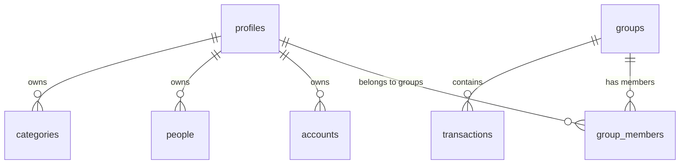

# Multi-Tenant Architecture & Design

This document details the multi-tenant architecture, database schema, role-based access control, and application flows for the Miu Expense ledger application.

---

## 1. Architectural Overview

The application is designed around a **multi-tenant model** where:
- A **tenant** is a **Group** (representing a shared family ledger).
- A **user** (Profile) can belong to multiple groups (tenants).
- All transactions, visual members, and shared records are scoped to their respective group tenant.



---

## 2. Database Schema Design (Supabase)

### Profiles Table (`public.profiles`)
Mirrors the system `auth.users` table. Note that `group_id` is **not** stored here to allow a single profile to join multiple groups.
* **Fields**: `id` (UUID, primary key), `email` (text), `updated_at` (timestamp).
* **RLS**: Authenticated users can query profiles by email to check if a user is registered before adding them to a group.

### Groups Table (`public.groups`)
Represents the group tenants.
* **Fields**: `id` (UUID, primary key), `name` (text), `created_at` (timestamp).
* **RLS**: Access is limited to users listed as members of the group in `group_members`.

### Group Members Junction Table (`public.group_members`)
The core junction table establishing the many-to-many relationship between users and groups.
* **Fields**: 
  - `id` (UUID, primary key).
  - `group_id` (UUID, references `groups.id`).
  - `user_id` (UUID, references `auth.users`, nullable).
  - `email` (text, matches registered email).
  - `role` (text: `owner` | `admin` | `member`).
  - `created_at` (timestamp).
* **Constraints**: Unique pair constraint on `(group_id, email)` to prevent duplicate memberships in the same group.

### Transactions Table (`public.transactions`)
* **Fields**: Scoped to a group via `group_id` (UUID, references `groups.id`). Includes details like amount, type, description, and keys referencing categories, accounts, and people.
* **RLS**: Row-level security matches read/write permissions based on the user's role in the corresponding group.

---

## 3. Row Level Security & Definer Functions

To prevent infinite recursion in RLS policies (e.g., checking `group_members` inside a `group_members` select policy), we use **Security Definer** helper functions. These functions run with database owner privileges, bypassing RLS inside their query scope:

1. **`public.is_group_member(group_id)`**: Returns `true` if the current user ID or email exists in the group's members list.
2. **`public.is_group_admin_or_owner(group_id)`**: Returns `true` if the user is a member with the role `admin` or `owner`.
3. **`public.is_group_owner(group_id)`**: Returns `true` if the user is the group's `owner`.

### Applied Policies
* **Groups**: Read access is granted if `is_group_member(id)` is true. Update access is granted if `is_group_owner(id)` is true.
* **Transactions**: Read/Insert is permitted for any group member. Update/Delete is permitted only for group admins or owners.
* **Group Members**: Read is permitted for any group member. Write/Modify is permitted only for group admins or owners.

---

## 4. Key Workflows & Features

### A. Pre-Onboarding & Auto-Linking
When a user is invited to a group by their email before they have registered an account, they are inserted into `group_members` with a `user_id` of `NULL`. 

Upon registration, a database trigger runs `public.link_new_user_to_groups()`, which automatically updates all matching empty `user_id` records in `group_members` to point to the newly created user ID:

```sql
CREATE OR REPLACE FUNCTION public.link_new_user_to_groups()
RETURNS TRIGGER AS $$
BEGIN
  UPDATE public.group_members
  SET user_id = NEW.id
  WHERE lower(email) = lower(NEW.email) AND user_id IS NULL;
  RETURN NEW;
END;
$$ LANGUAGE plpgsql SECURITY DEFINER;
```

### B. Client-Side Group Switching (Multi-Tenancy)
1. **Fetch**: On application load, the frontend fetches all groups the user belongs to from `group_members` (joining the `groups` table).
2. **Selection**: The user's active group is stored in React state (`activeGroup`) and persisted in `localStorage` under `miu_active_group` on the client device.
3. **Isolation**: When switching active groups, the app queries only the transactions and members belonging to that active group's ID.
