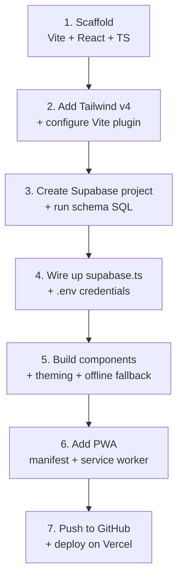

# Recipe Seed — Project Blueprint

> **Stack**: Vite · React · TypeScript · Tailwind CSS v4 · Supabase · Vercel  
> A concise blueprint for spinning up new projects on this architecture.  
> For detailed implementation, see [recipe.md](file:///Users/arifindobson/Documents/arifinProject/miu-expense/requirements/recipe.md) and [architect.md](file:///Users/arifindobson/Documents/arifinProject/miu-expense/requirements/architect.md).

---

## Architecture Overview

```
┌─────────────────────────────────────────────┐
│              Client (Browser)               │
│                                             │
│   React SPA ─── Tailwind CSS ─── PWA Shell  │
│       │                             │       │
│       ▼                             ▼       │
│   Supabase SDK              Service Worker  │
│       │                     + localStorage  │
└───────┼─────────────────────────────────────┘
        │
        ▼
┌───────────────────┐      ┌──────────────────┐
│  Supabase (BaaS)  │      │  Vercel (Host)   │
│  • Auth (Email)   │      │  • CI/CD from    │
│  • PostgreSQL     │      │    GitHub         │
│  • Row Level Sec  │      │  • Static CDN    │
│  • File Storage   │      │  • Env Vars      │
└───────────────────┘      └──────────────────┘
```

**Key Principle**: The client is a static SPA with zero server code. All backend logic lives in Supabase (auth, database, RLS policies, triggers). Vercel simply serves the built assets.

---

## Layer Guide

### 1. Frontend — React + Vite + Tailwind

| Concern | Approach |
|---------|----------|
| **Scaffolding** | `npx create-vite@latest ./ --template react-ts` |
| **Styling** | Tailwind CSS v4 as a Vite plugin — use `@utility` for custom classes |
| **State** | React hooks (`useState`, `useEffect`, `useMemo`) — no external state lib |
| **Navigation** | Tab-based via state variable, not a router |
| **Icons** | Lucide React (tree-shakable, stored as string keys in DB) |
| **Theming** | `ThemeConfig` objects mapping semantic tokens → Tailwind classes |

### 2. Backend — Supabase

| Concern | Approach |
|---------|----------|
| **Auth** | Email + Password via Supabase Auth |
| **Database** | PostgreSQL with RLS on every table |
| **Security** | `SECURITY DEFINER` helper functions to avoid RLS recursion |
| **Triggers** | Auto-seed defaults on signup, auto-link pre-invited users |
| **Storage** | Public-read bucket, auth-insert, owner-delete |
| **Client** | `@supabase/supabase-js` with a mock fallback when unconfigured |

### 3. Multi-Tenancy (Optional)

| Concern | Approach |
|---------|----------|
| **Tenant** | A `groups` table — each group is a shared workspace |
| **Membership** | `group_members` junction table (many-to-many with roles) |
| **Roles** | `owner` · `admin` · `member` — enforced by RLS + client UI |
| **Scoping** | Every domain table has a `group_id` FK |
| **Pre-invite** | Insert member by email with `user_id = NULL`, auto-link on signup |

### 4. PWA & Offline

| Concern | Approach |
|---------|----------|
| **Manifest** | `public/manifest.json` — standalone, portrait, themed |
| **Service Worker** | Stale-while-revalidate; skip Supabase API calls |
| **Offline data** | Fall back to `localStorage` for reads/writes |
| **ID convention** | Local IDs prefixed `default-`, filtered before DB inserts |

### 5. Deployment — Vercel

| Concern | Approach |
|---------|----------|
| **Trigger** | Auto-deploy on `git push` to GitHub |
| **Build** | `tsc -b && vite build` → `/dist` |
| **Config** | `vercel.json` with `buildCommand` |
| **Secrets** | `VITE_SUPABASE_URL` + `VITE_SUPABASE_ANON_KEY` as env vars |

---

## Project Skeleton

```
my-app/
├── index.html                  # Shell + PWA meta tags
├── .env                        # VITE_SUPABASE_URL, VITE_SUPABASE_ANON_KEY
├── vite.config.ts              # Plugins: react(), tailwindcss()
├── vercel.json                 # Build command
├── public/
│   ├── manifest.json           # PWA manifest
│   └── sw.js                   # Service Worker
├── src/
│   ├── main.tsx                # Bootstrap + SW registration
│   ├── App.tsx                 # Root component (state, auth gate, views)
│   ├── index.css               # @import "tailwindcss" + custom @utility
│   ├── components/             # Feature components
│   ├── lib/supabase.ts         # Client init + mock fallback
│   └── types/index.ts          # Shared interfaces
└── requirements/               # Docs, SQL migrations, guides
```

---

## Setup Flow



---

## Design Decisions

| Decision | Rationale |
|----------|-----------|
| **No router** | Single-screen mobile app; tab state is simpler and faster |
| **No state library** | App complexity doesn't warrant Redux/Zustand overhead |
| **Mock Supabase client** | Lets you develop UI without a live backend; prevents crashes |
| **Tailwind class tokens in DB** | Icons and colors stored as strings, resolved at runtime via lookup maps |
| **RLS over API middleware** | Security enforced at the database layer, not in application code |
| **localStorage fallback** | Ensures the app remains functional offline |

---

## Security Model

```
Client (anon key only)
  │
  ▼
Supabase Auth (JWT)
  │
  ▼
PostgreSQL RLS Policies
  ├── is_group_member(group_id)          → Can read?
  ├── is_group_admin_or_owner(group_id)  → Can write/delete?
  └── is_group_owner(group_id)           → Can manage group?
```

- The **anon key** is safe to ship — it only grants access through RLS-gated queries.
- All authorization lives in **database policies**, not client code.
- Client-side role checks are for **UX only** (hide buttons); the DB is the source of truth.

---

## Checklist — New Project

```
[ ] Scaffold Vite + React + TypeScript
[ ] Install deps: supabase-js, lucide-react, tailwindcss
[ ] Configure vite.config.ts (react + tailwindcss plugins)
[ ] Set up Tailwind v4 in index.css
[ ] Create Supabase project + run schema SQL
[ ] Create .env + src/lib/supabase.ts
[ ] Build components with ThemeConfig theming
[ ] Add localStorage offline fallback
[ ] Add PWA manifest + service worker
[ ] Push to GitHub + deploy on Vercel with env vars
```
